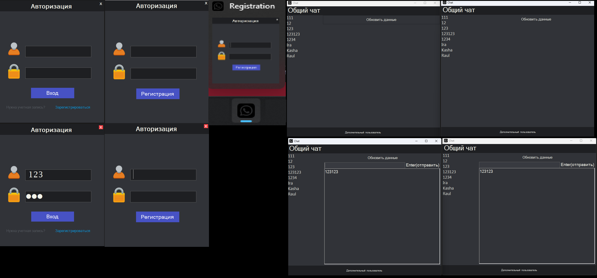

# ChatW
HomeTaskOfSkillFactory
1. Джохадзе Рауль, Никита Ковалёв
2. Джохадзе Рауль
3. Решено было работать с Windows Forms CLI и работы с файлами вместо сетей и баз данных из за того что не сразу было понятно как именно чат должен был работать был выдуман такой костыль Windows Forms, так как это было бы удобнее всего реализовавывать с учетом того, что мы на данный момент этого не должны знать по идее.
4. Реализованно автоматическое обновление данных для чата, грубо говоря, в у нас 3 формы: авторизация, регистрация и сам чат, при входе от более 2 людей в форме люди которые пишут в чат общий обновляются данные( задеркжа около секунды)  у всех кто находиться в форме чата. Так же при не корректных данных входа, не получиться войти в чат форму. Допускаю, что из за работы с файлами и хранением их в определённые разделы возможно проект не будет работать коректно, но работа с файлами реализованна не кардкодом и костылями и надеюсь все таки будет работать и доп фишек реализация регистрации и хранение данных в файлах о пользователе Логина и пароля , все логины,которые  существуют используются в ListBox то есть сами заносяться для получение сведений о наличие пользователей, чат между другими пользователями может работать не коректно из за проблемы реализации тек же самых файлов и это написано было через костыль из за самой входа, глобально не получалось объявить какой пользователь зашел для чата (Все файлы и их работы реализовываеться в папке Debug проекта, пароль для входа в некоторых уже существует "login - 123, password - 123", "login - 123123, password - 123123"). Когда ВЫ заходите под одним пользователём то при нажатие на доп пользователя, появляеться еще одна форма для входа и проче, для общнего чата нужно нажать на общий чат
5. Джохадзе Рауль - реализовал дизайн и работу с файлами, Никита Ковалёв реализовывал - аутификацию с регистрацией

   Использование библиотек и их сочетание
      #include <string>
      #include <fstream>
      #include <vector>
      #include <algorithm>
      #include <msclr/marshal_cppstd.h> 
      #include <filesystem>
   
Скрины по проекту 

